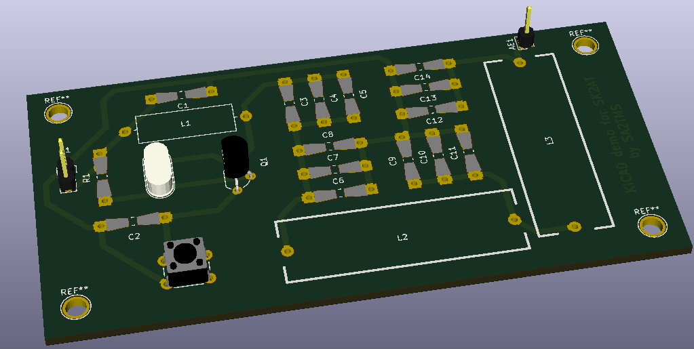

A small KiCAD demo for [SK2AT](http://www.fura.se)

Implements the [Ten Minute Transmitter](https://makerf.com/posts/ten-minute-transmitter)
for the 40 meter band plus a 5-pole low-pass filter.
The filter cuts the 2nd harmonic by 30 dB and the 3rd by 46 dB.

